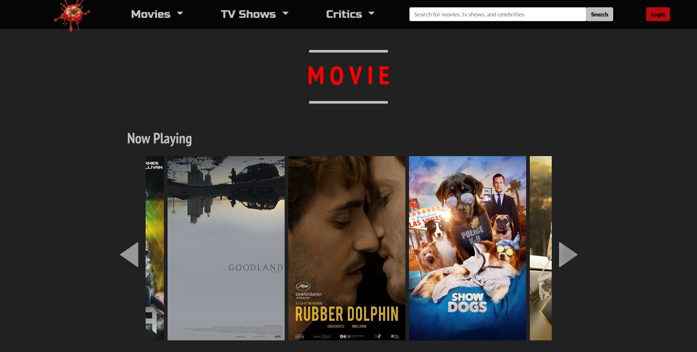
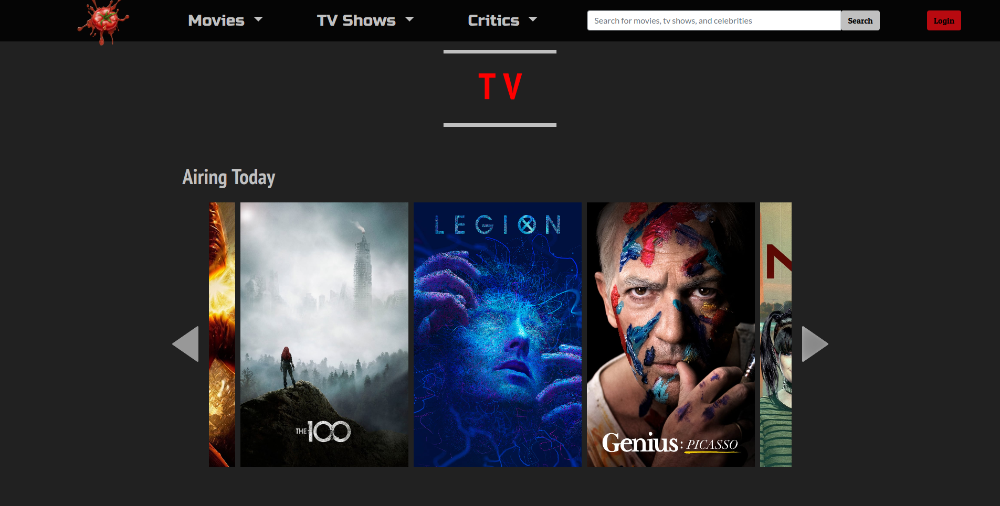
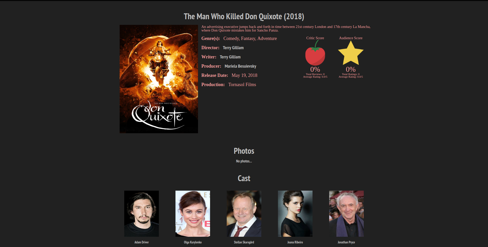

# Mashed Tomatoes 
A [Rotten Tomatoes](https://www.rottentomatoes.com/) clone built as a group project for CSE 308 (Software Engineering) at Stony Brook University.

## Tech Stack
The project is built using Java (Spring Boot) for the backend language, MySQL as the database, and Bootstrap, jQuery, and KnockoutJS for the frontend.

## Installation
This project requires Java and Maven to run.
Optionally, frontend development work uses NodeJS.


Verify that Java, Maven and NodeJS (only frontend devs) are installed.

```
java -version
javac -version
mvn -version
nodejs --version
```

In the project root, run this command to install dependencies. IDEs like IntelliJ IDEA and Eclipse will recognize the pom.xml in the project root and should be able to import the dependencies.

```
mvn install
```

In src/main/frontend folder, install frontend dependencies by running:

```
npm install
```


## Usage

### Environment Variables
The project depends on a few environment variables to run properly.

```
MT_MYSQL_DB_HOST=localhost # MySQL Database Host
MT_MYSQL_DB_PORT=3306 # MySQL Database Port
MT_MYSQL_DB_NAME=mashedtomatoes # MySQL Database Name
MT_MYSQL_USER=root # MySQL Username
MT_MYSQL_PASSWORD=password # MySQL Password
MT_DDL_AUTO_POLICY=none # Hibernate Update Policy for Schemas (none, update, create)
MAIL_USERNAME=foo@bar.com # Email Username for Mailing
MAIL_PASSWORD=password # Email Password for Mailing
MAIL_HOST=smtp.bar.com # Email Host
MAIL_PORT=25 # Email Port
MT_FILES_PATH=file:///foo/bar/mtimg/ # Root folder for images
```

### Sample Data
To use the provided sample data, view the following points.

#### MySQL Dump File
Import [Sample SQL Dump File](sample/sample.sql)


#### Images
Download [Sample Images](https://nofile.io/f/uqxsOZ8PfsK/mtimg.tar.gz) and decompress the folder. Update MT_FILES_PATH to point to the decompressed directory.

### Running
To start a local Tomcat server run (defaults to port 8080):

```
mvn exec:java
```

Alternatively, IDEs like IntelliJ IDEA and Eclipse should recognize this as a Spring Boot project and should be able to run the project.

Now, go to http://localhost:8080/ on your favorite browser and enjoy.

## Screenshots
##### Homepage Movie Section

##### Homepage TV Section

##### Movie Page



## License
`Mashed Tomatoes` is a public domain work, dedicated using
[CC0 1.0](https://creativecommons.org/publicdomain/zero/1.0/). Feel free to do whatever you want with it.
